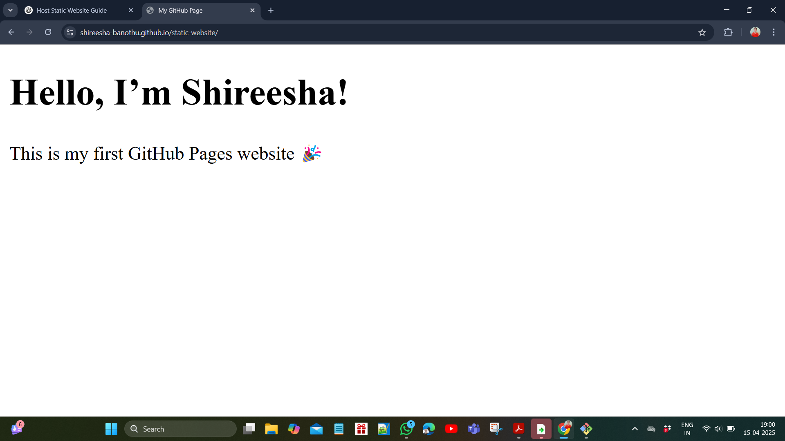

# 🌐 Static Website with GitHub Pages

This is a simple static website hosted using **GitHub Pages** as part of my DevOps internship task.

## 🚀 Live Website

👉 [Click here to view the website](https://shireesha-banothu.github.io/static-website/)

## 🖼 Output Screenshot

## 📁 Project Structure

## 💡 What I Learned

- How to create and structure an HTML file
- How to initialize and push a Git repo to GitHub
- How to enable GitHub Pages to host static websites
- How to add screenshots and update README.md

## 🛠 Tools Used

- HTML & CSS
- Git & GitHub
- GitHub Pages

